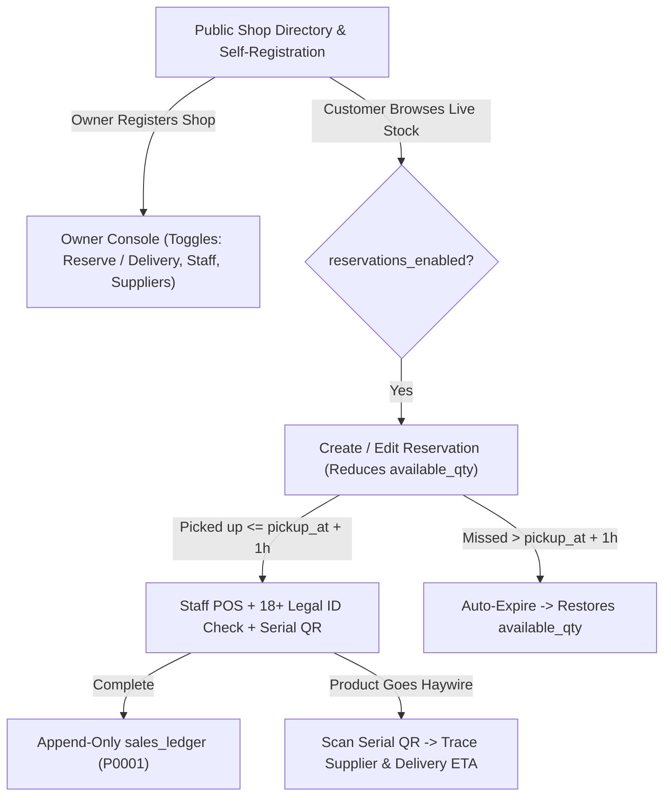

# App Flow (`PM-06`) — VapeShop SaaS

```mermaid
flowchart TD
    Landing["Public Shop Directory & Self-Registration"] -->|Owner Registers Shop| OwnerDash["Owner Console (Toggles: Reserve / Delivery, Staff, Suppliers)"]
    Landing -->|Customer Browses Live Stock| Reserve{"reservations_enabled?"}
    Reserve -->|Yes| CreateRes["Create / Edit Reservation (Reduces available_qty)"]
    CreateRes -->|Picked up <= pickup_at + 1h| POS["Staff POS + 18+ Legal ID Check + Serial QR"]
    CreateRes -->|Missed > pickup_at + 1h| Expire["Auto-Expire -> Restores available_qty"]
    POS -->|Complete| Ledger["Append-Only sales_ledger (P0001)"]
    POS -->|Product Goes Haywire| QRTrace["Scan Serial QR -> Trace Supplier & Delivery ETA"]
```
